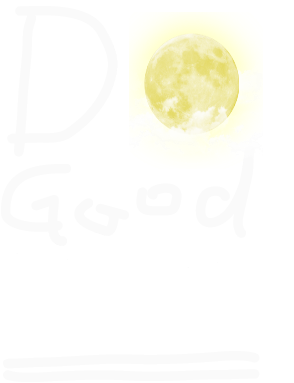

<div align="center">
  <br />
  
  <h1>두굿이브닝 (Do Good evening)</h1>
  <br />
</div>

## 목차

1. [**프로젝트 진행 배경**](#1)
1. [**웹 서비스 소개**](#2)
1. [**기술 스택**](#3)
1. [**주요 기능**](#4)
1. [**데모 영상**](#5)
1. [**개발 팀 소개**](#6)
1. [**개발 기간**](#7)
1. [**실행 방법**](#8)

<br />

<div id="1"></div>

## 🌜 프로젝트 진행 배경

Nextjs로 개발한 **포트폴리오**와 누군가와 **함께 작업**한 듯한 결과물이 필요하여 진행한 프로젝트 입니다.

[DevFoliOh!](https://devfolio.kr/project/51)에서 마음에 드는 작업물을 선정하여 프로젝트를 진행했습니다.

### 네. Copycat 입니다

누군가의 발자취를 따라가는 것이지만 저는 이러한 과정에서 원작자의 코드 스타일을 참고하고, <br/>
내가 작성한 코드와 어떤 차이가 있는지를 보는 과정속에서도 배움이 있다고 생각합니다.<br/>
또한, 코드를 뜯어보는 것 또한 개발자의 중요한 덕목 중 하나라고 생각합니다.

월마트의 창업자 '샘 월튼'은 '내가 한 일은 대부분 모방이었다.'라는 명언을 남기기도 했습니다.<br/>
짝퉁을 시작으로, 세계 1위 카피캣으로 거듭나도록 하겠습니다.

### 혼자 작업하는데 함께 한다?

혼자 1인 개발을 하지만,<br/>
git 다루는거에 익숙해지기 위해 깃허브 아이디를 하나 더 생성하여 역할분담을하여 개발을 진행했습니다.

철저하게 이중인격으로 활동하였습니다.

<br />

<div id="2"></div>

## 💁🏻‍♂ 웹 서비스 소개

서로의 저녁 노을을 공유해 외롭지않은 저녁 그리고 굿이브닝을 실천하게 해주는 두굿이브닝 서비스입니다.<br/>
세계 각국에서 업로드하는 저녁 풍경 사진들을 통해 세계 여행을 즐기실 수 있습니다.

<br />

<div id="3"></div>

## 🛠 기술 스택

### **Front-end**

|  |  |  |
| :----------------------------------------------------------------------------------------------------------------------------: | :--------------------------------------------------------------------------------------------------------------------------: | :-----------------------------------------------------------------------------------------------------------------------------: |
|                                                             HTML5                                                              |                                                             CSS3                                                             |                                                         JavaScript(ES6)                                                         |

|  |  |  |
| :----------------------------------------------------------------------------------------------------------------------------: | :----------------------------------------------------------------------------------------------------------------------------------------------------------: | :-----------------------------------------------------------------------------------------------------------------------------------------------: |
|                                                          Nextjs13.js                                                           |                                                                         tailwind css                                                                         |                                                                      Swiper                                                                       |

### **Back-end**

|  |
| :-------------------------------------------------------------------------------------------------------------------------------------------------------: |

FireBase

### **Version Control**

|  |  |
| :---------------------------------------------------------------------------------------------------------------: | :--------------------------------------------------------------------------------------------------------------------: |
|                                                        Git                                                        |                                                         GitHub                                                         |

<br />

<br />

<div id="4"></div>

## 💡 주요 기능

- 사진 업로드와 멘션을 통한 그날의 기분과 하루를 어떻게 마무리 하는지를 공유
- 세계지도 UI를 통해 실시간 나이트존(PM 21:00 ~ 24:00) 위치를 확인하고 베스트 노을 컷 표기
- 세계 각국에서 올리는 게시물들을 다양한 기준으로 통계하여 랭킹으로 시각화

<br />

<div id="5"></div>

## 🎥 데모 영상

추후 업데이트 예정..

<br />

<div id="6"></div>

## 👪 개발 팀 소개

[**🔗 팀 개발 규칙 바로가기 Click !**](https://github.com/do-good-morning/do-good-morning/tree/master/team-rules) 👈

<br />

<div id="7"></div>

## 📅 개발 기간

`23.09.19.(화) ~ 추후 개발 끝나면 업데이트 예정`
<br />

<div id="8"></div>

## 💻 실행 방법

1. **원격 저장소 복제**

```bash
$ git clone https://github.com/jungsikjeong/do-good-evening
```

2.  **root 디렉토리에서 필요한 node_modules 설치**

```bash
$ npm install
```

3. **nextjs(클라이언트) 앱 실행**

```bash
$ npm run dev
```

<br />
